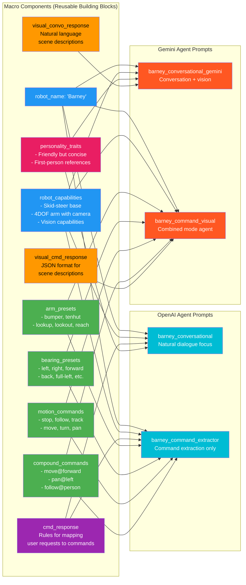
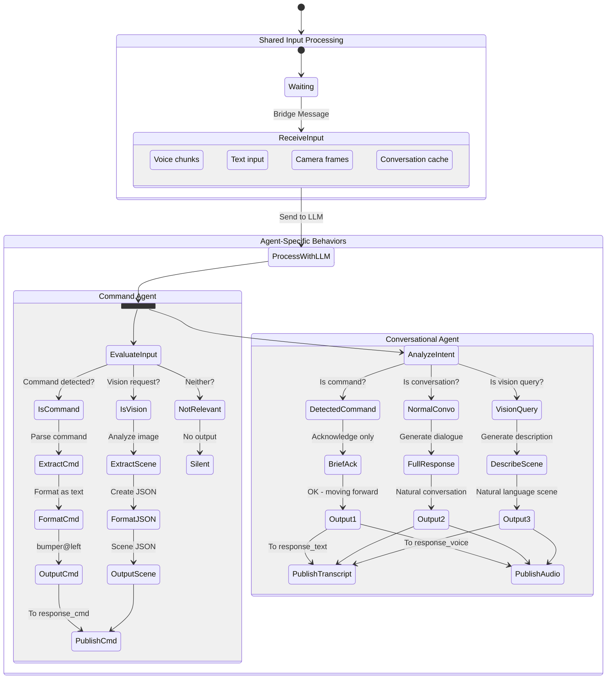
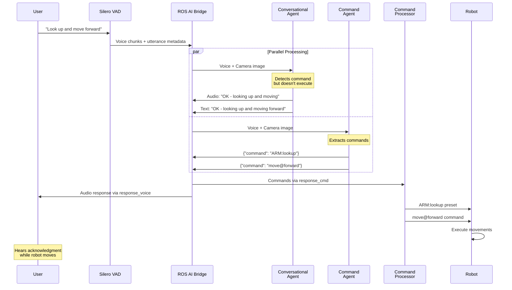
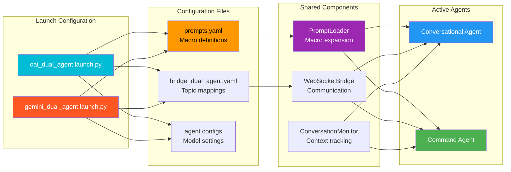

# System Prompt Architecture Diagrams

This document visualizes how system prompts are constructed from reusable components and how the dual-agent architecture processes commands and conversations.

## 1. Prompt Construction Architecture

Shows how macro components are combined to build complete agent prompts:

## 2. Dual-Agent Processing Architecture

Illustrates how voice and vision inputs flow through the system to both agents:

```mermaid
flowchart TB
    subgraph "Input Sources"
        A[🎤 Microphone] --> B[Audio Capturer]
        C[📷 Camera] --> D[Image Compression]
    end
    
    subgraph "Processing Pipeline"
        B --> E[Silero VAD]
        E --> F[Voice Chunks]
        D --> G[Compressed Images]
    end
    
    subgraph "ROS AI Bridge"
        F --> H[WebSocket Server<br/>Port 8765]
        G --> H
        I[Text Input] --> H
    end
    
    subgraph "Parallel Agent Processing"
        H --> J[Conversational Agent<br/>barney_conversational]
        H --> K[Command Agent<br/>barney_command_extractor]
        
        J --> L[Process for Dialogue]
        J --> M[Detect but Don't Execute Commands]
        
        K --> N[Extract Commands]
        K --> O[Generate Scene JSON]
    end
    
    subgraph "Output Topics"
        L --> P[response_voice<br/>Voice Response]
        L --> Q[response_text<br/>Conversation Text]
        M --> R["Brief Acknowledgment<br/>'OK - moving forward'"]
        N --> S[response_cmd<br/>Movement Commands]
        O --> S
    end
    
    subgraph "Robot Control"
        S --> T[Command Processor]
        T --> U[Robot Actuators]
    end
    
    style A fill:#2196f3,color:#fff
    style C fill:#2196f3,color:#fff
    style J fill:#00bcd4,color:#fff
    style K fill:#ff5722,color:#fff
    style P fill:#4caf50,color:#fff
    style Q fill:#4caf50,color:#fff
    style S fill:#ff9800,color:#000
```

## 3. Agent Behavior State Machines

Shows the decision logic for each agent type:

## 4. Prompt Macro Expansion Process

Demonstrates the recursive expansion of macros in prompt templates:

```mermaid
graph TD
    subgraph "Original Template"
        T["barney_conversational prompt template"]
        T --> T1["Your name is {{robot_name}}"]
        T --> T2["{{robot_capabilities}}"]
        T --> T3["{{cmd_response}}"]
        T --> T4["{{personality_traits}}"]
    end
    
    subgraph "First Level Expansion"
        T1 --> E1["Your name is Barney"]
        T2 --> E2["You are a real skid-steer robot<br/>that can move around and you have<br/>one 4dof arm that can move a camera..."]
        T3 --> E3["Infer or use synonyms to map user<br/>requests to valid COMMANDS...<br/>{{arm_presets}}<br/>{{bearing_presets}}<br/>{{motion_commands}}"]
        T4 --> E4["You are friendly but concise.<br/>Provide information and assistance."]
    end
    
    subgraph "Second Level Expansion (Recursive)"
        E3 --> F1["Arm Positions:<br/>bumper - arm folded low<br/>tenhut - vertical stance<br/>lookup - raised to face person<br/>lookout - elevated forward<br/>reach - extended forward"]
        E3 --> F2["Bearing Presets:<br/>left: -45°<br/>right: 45°<br/>forward: 0°<br/>back: 180°<br/>full-left: -90°"]
        E3 --> F3["Motion Commands:<br/>stop, follow, track<br/>sleep, wake, move<br/>turn, pan"]
    end
    
    subgraph "Final Expanded Prompt"
        G["Complete system prompt with<br/>all macros fully expanded<br/>~2000 tokens"]
    end
    
    E1 --> G
    E2 --> G
    E4 --> G
    F1 --> G
    F2 --> G
    F3 --> G
    
    style T fill:#9c27b0,color:#fff
    style T1 fill:#2196f3,color:#fff
    style T2 fill:#2196f3,color:#fff
    style T3 fill:#2196f3,color:#fff
    style T4 fill:#2196f3,color:#fff
    style E3 fill:#ff9800,color:#000
    style F1 fill:#4caf50,color:#fff
    style F2 fill:#4caf50,color:#fff
    style F3 fill:#4caf50,color:#fff
    style G fill:#00bcd4,color:#fff
```

## 5. Command Processing Pipeline

Shows the complete flow from user input to robot action:

## 6. Agent Comparison Matrix

| Aspect | Conversational Agent | Command Agent |
|--------|---------------------|---------------|
| **Primary Role** | Natural dialogue & descriptions | Command extraction & scene analysis |
| **Prompt Used (OAI)** | `barney_conversational` | `barney_command_extractor` |
| **Prompt Used (Gemini)** | `barney_conversational_gemini` | `barney_command_visual` |
| **Command Handling** | Acknowledges with "OK - [action]" | Extracts and formats as JSON |
| **Conversation** | Full natural responses | Silent (no response) |
| **Vision Queries** | Natural language descriptions | JSON object list with coordinates |
| **Audio Output** | ✅ Enabled | ❌ Disabled |
| **Text Output Topic** | `/response_text` | `/response_cmd` |
| **Macros Used** | `robot_name`, `robot_capabilities`, `cmd_response`, `personality_traits` | `robot_name`, `robot_capabilities`, `arm_presets`, `bearing_presets`, `motion_commands` |
| **Response Examples** | "I can see a red ball on the table" | `{"command": "ARM:lookup"}` |
| **Silent Conditions** | Never (always responds) | Non-command inputs |

## 7. System Integration Overview

## Key Insights

1. **Macro System**: The prompt construction uses a sophisticated macro expansion system that allows reusable components to be shared across different agent configurations.

2. **Separation of Concerns**: The dual-agent architecture cleanly separates conversation handling from command extraction, allowing each agent to specialize.

3. **Parallel Processing**: Both agents receive the same inputs simultaneously but process them differently based on their specialized prompts.

4. **Graceful Degradation**: If one agent fails, the other can continue operating, providing robustness to the system.

5. **Platform Flexibility**: The same architecture supports both OpenAI and Gemini backends with platform-specific prompt optimizations.